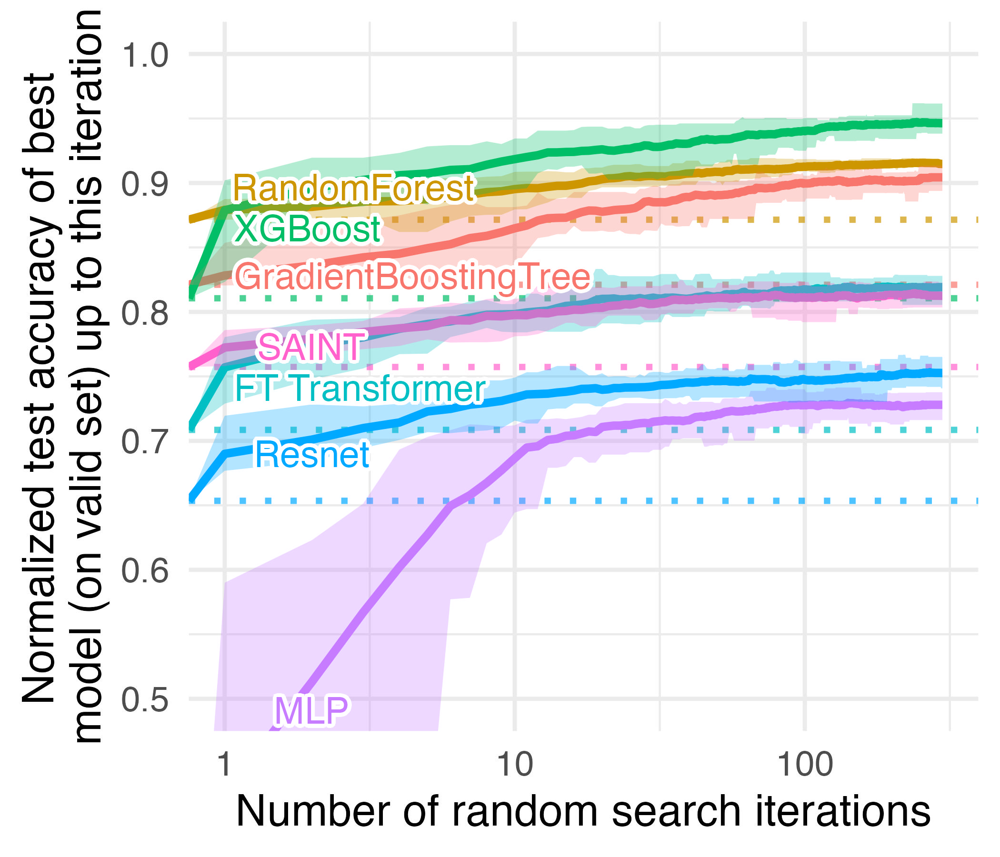

# Tabular data learning benchmark

Accompanying repository for the paper *Why do tree-based models still outperform deep learning on tabular data?*



# Replicating the paper's results

## Installation

Create a new environment using python 3.8, then install the requirements:

`pip install -r requirements.txt`

## Downloading the datasets

To download these datasets, simply run `python data/download_data.py`.

## Training the models

You can re-run the training using WandB sweeps.

1. Copy / clone this repo on the different machines / clusters you want to use.
2. Login to WandB and add your wandb id to `src/configs/wandb_config.py`
3. Move into `src`
``4. run `python launch_config/launch_benchmarks.py`. This will create a csv with the wandb sweep to run. 
5. (Long?) You can run each sweep by running `wandb agent <USERNAME/PROJECTNAME/SWEEPID>` in `src`. More infos
[in the WandB doc](https://docs.wandb.ai/guides/sweeps/quickstart#4.-launch-agent-s).
6. If your using a cluster, run `launch_benchmarks/launch_on_cluster.py --filename NAME_OF_THE_CSV_FILE --output_filename FILENAME --n_runs NUMBER_OF_PARALLEL_RUNS_PER_SWEEP --max_runs MAX_NUMBER_OF_RUN_PER_DATASET --monitor`. 
You'll need to adapt the 
script to your cluster (see the TODO comments in the script). This will automatically launch the sweeps on the cluster
and download the results when they are done.``

## Replicating the analyses / figures

All the R code used to generate the analyses and figures in available in the `analyses` folder.


# Benchmarking your own algorithm

## Downloading the datasets

The datasets used in the benchmark have been uploaded as OpenML
benchmarks, with the same transformations that are used in the paper.

```
import openml
#openml.config.apikey = 'FILL_IN_OPENML_API_KEY'  # set the OpenML Api Key
SUITE_ID = 297 # Regression on numerical features
#SUITE_ID = 298 # Classification on numerical features
#SUITE_ID = 299 # Regression on numerical and categorical features
#SUITE_ID = 304 # Classification on numerical and categorical features
benchmark_suite = openml.study.get_suite(SUITE_ID)  # obtain the benchmark suite
for task_id in benchmark_suite.tasks:  # iterate over all tasks
    task = openml.tasks.get_task(task_id)  # download the OpenML task
    dataset = task.get_dataset()
    X, y, categorical_indicator, attribute_names = dataset.get_data(
        dataset_format="dataframe", target=dataset.default_target_attribute
    )
```

You can also find these datasets on [Hugging Face Hub](https://huggingface.co/datasets/inria-soda/tabular-benchmark).

## Using our results

If you want to compare you own algorithms with the models used in 
this benchmark for a given number of random search iteration,
you can use the results from our random searches, which we share 
as two csv files located in the `analyses/results` folder.

## Using our code

To benchmark your own algorithm using our code, you'll need:

- a model which uses the sklearn's API, i.e having fit and predict methods.
We recommend using [Skorch](https://skorch.readthedocs.io/en/stable/net.html) use sklearn's API with a Pytorch model.
- to add your model hyperparameters search space to the template config `src/configs/model_configs/template.py`.
- to run the benchmarks as explained in **Training the models**.


